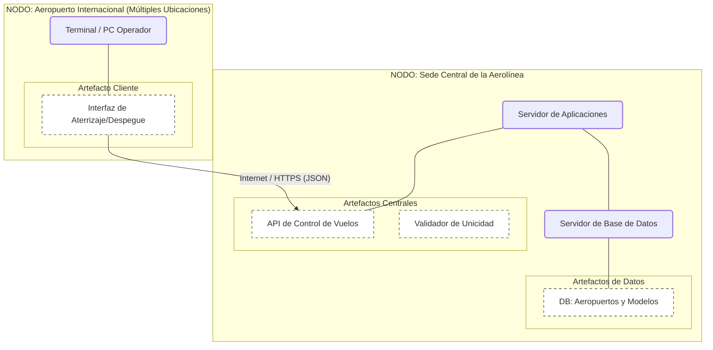

# Diagrama_Despliegue

```mermaid
graph TD
    %% Estilos para simular Nodos UML
    classDef nodo fill:#ECECFF,stroke:#9370DB,stroke-width:2px,rx:5,ry:5;
    classDef artefacto fill:#FFFFFF,stroke:#333,stroke-width:1px,stroke-dasharray: 5 5;

    subgraph "NODO: Sede Central de la Aerolínea"
        direction TB
        ServerApp[Servidor de Aplicaciones]:::nodo
        subgraph "Artefactos Centrales"
            API[API de Control de Vuelos]:::artefacto
            Logica[Validador de Unicidad]:::artefacto
        end
        
        ServerDB[Servidor de Base de Datos]:::nodo
        subgraph "Artefactos de Datos"
            DB_Vuelos[DB: Aeropuertos y Modelos]:::artefacto
        end
    end

    subgraph "NODO: Aeropuerto Internacional (Múltiples Ubicaciones)"
        direction TB
        PC_Terminal[Terminal / PC Operador]:::nodo
        subgraph "Artefacto Cliente"
            AppCliente[Interfaz de Aterrizaje/Despegue]:::artefacto
        end
    end

    %% Conexiones
    ServerApp --- ServerDB
    AppCliente -- "Internet / HTTPS (JSON)" --> API
    
    %% Relación Interna
    ServerApp --- API
    ServerDB --- DB_Vuelos
    PC_Terminal --- AppCliente
```
