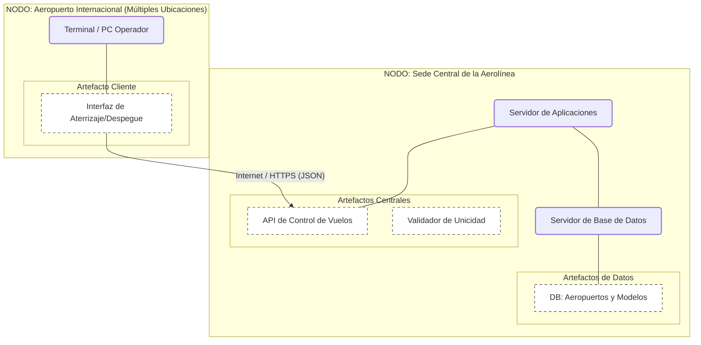

# Diagrama_Despliegue

#Cliente Servidor
```mermaid
graph TD
    %% Estilos
    classDef nodo fill:#D5F5E3,stroke:#2ECC71,stroke-width:2px,rx:5,ry:5;
    classDef artefacto fill:#FFFFFF,stroke:#333,stroke-width:1px,stroke-dasharray: 5 5;

    subgraph "NODO: Dispositivo del Cliente"
        direction TB
        Dispositivo[PC o Smartphone]:::nodo
        subgraph "Capa de Presentación"
            Browser[Navegador Web / App Móvil]:::artefacto
        end
    end

    subgraph "NODO: Servidor Web (Nube)"
        direction TB
        WebServer[Servidor de Aplicaciones]:::nodo
        subgraph "Capa de Negocio"
            Frontend[Frontend (React/Angular/Vue)]:::artefacto
            Backend[Backend (Node/Java/Python)]:::artefacto
        end
    end

    subgraph "NODO: Servidor de Datos"
        direction TB
        DBServer[Servidor SGBD]:::nodo
        subgraph "Capa de Datos"
            Schema[Base de Datos Relacional]:::artefacto
        end
    end

    %% Conexiones Físicas y Lógicas
    Dispositivo --- Browser
    WebServer --- Frontend
    DBServer --- Schema

    %% Comunicación de Red
    Browser -- "HTTP/HTTPS (Puerto 443)" --> Frontend
    Backend -- "Conexión JDBC/ODBC" --> Schema
```
